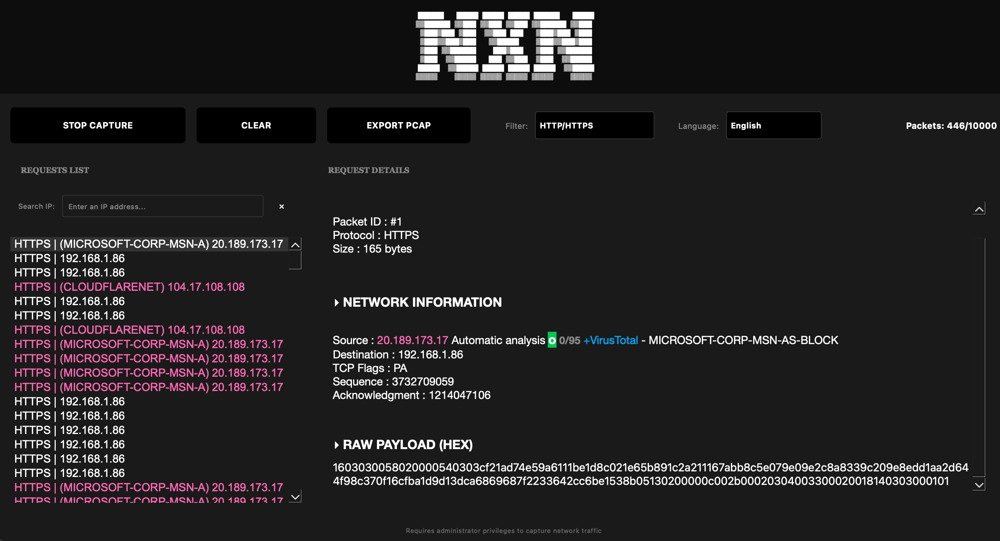
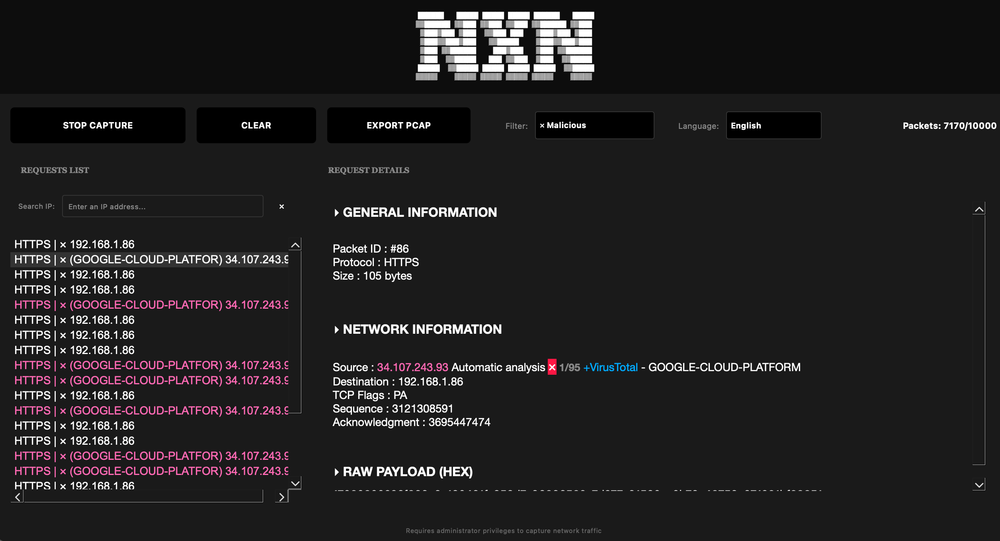

```888b    888 Y88b   d88P 888b    888 
8888b   888  Y88b d88P  8888b   888 
88888b  888   Y88o88P   88888b  888 
888Y88b 888    Y888P    888Y88b 888 
888 Y88b888    d888b    888 Y88b888 
888  Y88888   d88888b   888  Y88888 
888   Y8888  d88P Y88b  888   Y8888 
```                                    
 <br>


NXN Tool allows you to capture HTTP/HTTPS requests and identify potentially malicious traffic.
Each request can be automatically analyzed through VirusTotal, with an indicative score (e.g., 0/95).
A direct link to VirusTotal is available for more detailed inspection.

The software also detects false positives (for example, a 1/95 score).
Customizable filters allow you to modify displayed requests and change the interface language.

Captured data can be exported in .pcap format and imported into Wireshark for deeper analysis.
The capture is limited to 10,000 packets. 


<br><br>


## Installation process


```bash
git clone https://github.com/nxn11/capture_tool.git
cd captrure_tool
chmod +x cap.py
./cap.py
```

<br>

#1 Create the virtual environment
```bash
python3 -m venv venv
source venv/bin/activate
venv\Scripts\activate
```

<br>

#2 Install the required libraries
```bash
pip install PyQt6
pip install plyer
pip install scapy
pip install requests
```

<br>

#3 Installation completed
```bash
chmod +x cap.py
python cap.py
```


<br><br><br>


Moves into the cloned project directory.
cd capture_tool


Makes the file cap.py executable so it can be run as a script.
chmod +x cap.py


Runs your Python tool.
This starts the capture process or displays available options, depending on how the script is written.
python cap.py

<br><br>

## Requirements

Before running the tool, you must install the following.

The tool requires Python 3.
Download and install it from:
https://www.python.org/downloads/


Make sure the python3 command works:
python3 --version  

<br><br><br><br><br>







